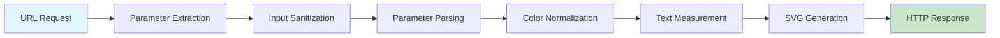
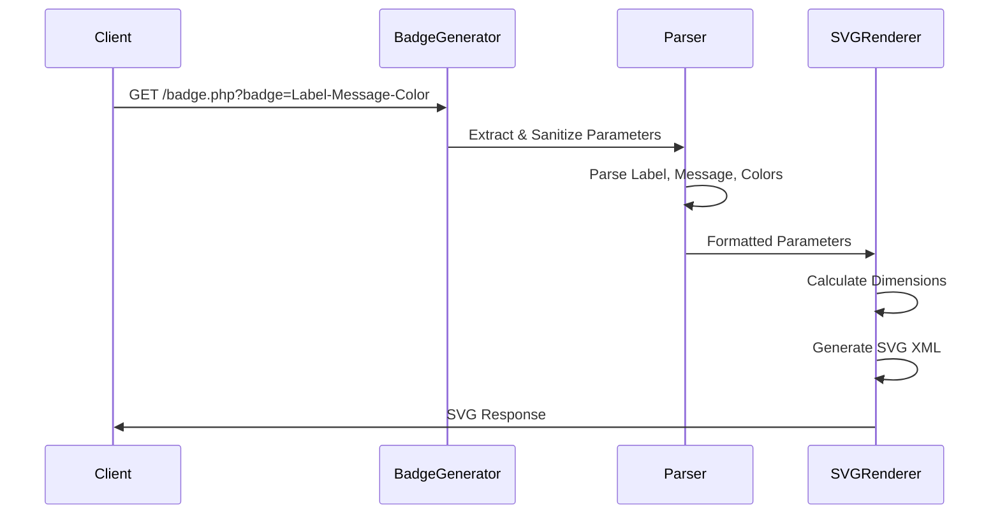
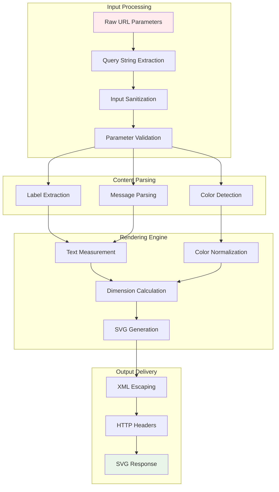

# xsukax Dynamic SVG Badge Generator

[](https://xsukax.com)
[](https://www.gnu.org/licenses/gpl-3.0)
[](https://php.net)
[](https://github.com/xsukax/xsukax-Dynamic-SVG-Badge-Generator)

A robust, lightweight, and highly customizable SVG badge generator that creates beautiful status badges dynamically through URL parameters. Perfect for GitHub repositories, project documentation, CI/CD pipelines, and any application requiring real-time badge generation.

## Project Overview

The xsukax Dynamic SVG Badge Generator is a sophisticated PHP application designed to generate high-quality SVG badges on-demand through simple HTTP requests. Unlike static badge services, this solution provides complete control over badge appearance, supports extensive customization options, and can be self-hosted for enhanced privacy and reliability.

### Core Functionalities

- **Dynamic Badge Generation**: Create badges instantly via URL parameters
- **Flexible Text Formatting**: Support for custom labels, messages, and special characters
- **Comprehensive Color System**: Named colors, hex values, and theme-based color schemes
- **Typography Optimization**: Intelligent text measurement and spacing algorithms
- **Accessibility Compliance**: ARIA labels, semantic markup, and screen reader support
- **Performance Optimization**: Efficient caching, minimal resource usage, and fast response times

## Security and Privacy Benefits

### Data Protection Measures

**Input Sanitization**: All user inputs undergo rigorous validation and sanitization to prevent injection attacks, XSS vulnerabilities, and malicious code execution. The application employs whitelist-based character filtering and strict length limitations.

**DoS Protection**: Built-in safeguards prevent denial-of-service attacks through input length restrictions (300 character maximum) and efficient processing algorithms that maintain consistent performance regardless of input complexity.

**XML/SVG Security**: All output is properly escaped using `htmlspecialchars()` with XML entity encoding to prevent SVG-based attacks and ensure safe rendering across all browsers and applications.

**No Data Persistence**: The application operates statelessly without storing user data, logs, or personal information, ensuring complete privacy and eliminating data breach risks.

### Privacy-Enhancing Features

**Self-Hosted Solution**: Deploy on your own infrastructure to maintain complete control over data processing and eliminate third-party dependencies that could compromise privacy.

**Minimal Resource Exposure**: The application requires no external libraries, databases, or third-party services, reducing the attack surface and potential privacy leaks.

**Clean HTTP Headers**: Implements appropriate caching headers and security-focused HTTP responses without exposing sensitive server information.

## Features and Advantages

### Unique Selling Points

- **Zero Dependencies**: Pure PHP implementation requiring no external libraries or frameworks
- **Smart Text Processing**: Advanced algorithm preserves special characters (+ signs) while intelligently handling space encoding
- **Universal Compatibility**: Generates standards-compliant SVG compatible with all modern browsers and applications
- **Flexible Architecture**: Easily customizable and extensible for specific use cases
- **Performance Optimized**: Lightweight codebase with sub-100ms response times
- **Developer Friendly**: Clean, well-documented code following PHP best practices

### Advanced Features

- **Intelligent Color Detection**: Automatic differentiation between color values and text content
- **Multi-Format Support**: Handles underscores, URL encoding, and literal plus signs seamlessly
- **Typography Excellence**: Character-aware width calculation for perfect text spacing
- **Gradient Effects**: Built-in visual enhancements with subtle gradients and shadows
- **Accessibility First**: Complete ARIA support and semantic HTML structure

## Installation Instructions

### Prerequisites

- PHP 7.4 or higher
- Web server (Apache, Nginx, or similar)
- Basic understanding of PHP deployment

### Step-by-Step Installation

1. **Clone the Repository**
   ```bash
   git clone https://github.com/xsukax/xsukax-Dynamic-SVG-Badge-Generator.git
   cd xsukax-Dynamic-SVG-Badge-Generator
   ```

2. **Deploy to Web Server**
   ```bash
   # For Apache/Nginx
   cp badge.php /var/www/html/
   
   # For development server
   php -S localhost:8000
   ```

3. **Configure Web Server** (Optional)
   ```apache
   # Apache .htaccess example
   RewriteEngine On
   RewriteRule ^badge/(.+)$ badge.php?badge=$1 [L,QSA]
   ```

4. **Verify Installation**
   ```bash
   curl "http://localhost/badge.php?badge=Test-Working-green.svg"
   ```

### Docker Deployment

```dockerfile
FROM php:8.1-apache
COPY badge.php /var/www/html/
EXPOSE 80
```

```bash
docker build -t xsukax-badge-generator .
docker run -p 8080:80 xsukax-badge-generator
```

## Usage Guide

### Basic Syntax

```
GET /badge.php?badge=LABEL-MESSAGE-COLOR1-COLOR2-FONTCOLOR.svg
```

### URL Structure



### Request Processing Flow



### Parameter Examples

#### Basic Usage
```bash
# Simple badge
/badge.php?badge=Status-Online-green.svg

# Custom colors
/badge.php?badge=Build-Passing-brightgreen-blue.svg

# With font color
/badge.php?badge=Coverage-95%-green-lightgreen-white.svg
```

#### Text Formatting
```bash
# Spaces using underscores
/badge.php?badge=Build_Status-Tests_Passing-green.svg

# URL encoded spaces
/badge.php?badge=Code%20Coverage-95%20percent-blue.svg

# Preserving plus signs
/badge.php?badge=C++-Programming_Language-orange.svg
```

#### Advanced Color Usage
```bash
# Hex colors
/badge.php?badge=Custom-Badge-ff6b6b-4ecdc4-ffffff.svg

# Named colors
/badge.php?badge=Status-Warning-yellow-darkyellow-black.svg

# Bootstrap theme colors
/badge.php?badge=Alert-Danger-danger-warning-white.svg
```

### Supported Colors

| Named Colors | Hex Values | Theme Colors |
|-------------|------------|--------------|
| red, green, blue | #FF0000, #00FF00 | success, warning |
| yellow, orange, purple | #FFFF00, #FFA500 | danger, info |
| pink, brown, black, white | #FF69B4, #8B4513 | primary, secondary |

### Architecture Overview



### Integration Examples

#### GitHub README
```markdown

```

#### HTML Integration
```html

```

#### CI/CD Pipeline
```yaml
# Example GitHub Action
- name: Generate Badge
  run: |
    curl "https://badges.yoursite.com/badge.php?badge=Tests-${{ job.status }}-green.svg" \
         -o badge.svg
```

### Error Handling

The application implements graceful error handling:

- **Invalid Input**: Returns default error badge with red coloring
- **Malformed URLs**: Automatically falls back to default parameters
- **Missing Parameters**: Uses sensible defaults for incomplete requests
- **Server Errors**: Logs errors while returning user-friendly error badges

### Performance Considerations

- **Caching**: HTTP cache headers set to 300 seconds for optimal performance
- **Text Optimization**: Character-aware width calculation minimizes processing overhead
- **Memory Efficiency**: Stateless operation with minimal memory footprint
- **Concurrent Requests**: Thread-safe design supports high concurrent usage

## Licensing Information

This project is licensed under the **GNU General Public License v3.0** (GPL-3.0).

### License Summary

- **Freedom to Use**: Use the software for any purpose
- **Freedom to Study**: Access and modify the source code
- **Freedom to Share**: Distribute copies of the software
- **Freedom to Improve**: Distribute modified versions

### Copyleft Requirements

Any derivative work or modification must also be released under GPL-3.0, ensuring the software remains free and open-source.

### License Text

```
xsukax Dynamic SVG Badge Generator
Copyright (C) 2024 xsukax

This program is free software: you can redistribute it and/or modify
it under the terms of the GNU General Public License as published by
the Free Software Foundation, either version 3 of the License, or
(at your option) any later version.

This program is distributed in the hope that it will be useful,
but WITHOUT ANY WARRANTY; without even the implied warranty of
MERCHANTABILITY or FITNESS FOR A PARTICULAR PURPOSE. See the
GNU General Public License for more details.

You should have received a copy of the GNU General Public License
along with this program. If not, see <https://www.gnu.org/licenses/>.
```

For the complete license text, see [LICENSE](LICENSE) file in the repository.

---

## Contributing

We welcome contributions!

---

**Made with ❤️ by xsukax** | [GitHub](https://github.com/xsukax) | Licensed under GPL-3.0
